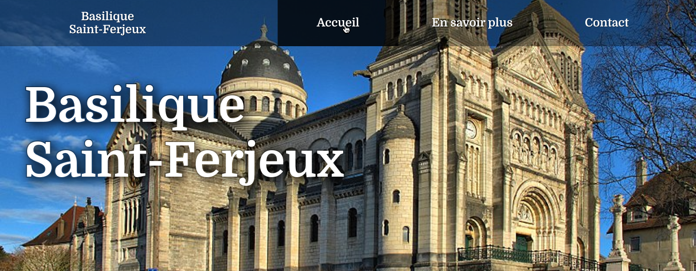

# Projet 1 : Basilique Saint-Ferjeux de Besançon
Réflexion autour d'un projet de réalisation d'un site web pour la basilique Saint-Ferjeux de Besançon.

## Itération #1
### #A.1 : Analyse
* Identité visuelle existante ? Aucune. Cathédrale en pierre, tons clairs, nuances de gris.
* Stratégie digitale : page TripAdvisor, pas de site web, pas de RS…

### #A.2 : Cahier des charges
#### Présentation
Monument historique du XIXème siècle, de style romano-byzantin, la basilique Saint-Fergeux ne dispose pas de site Internet à ce jour.

#### Cible à laquelle s'adresse le site
Touristes qui souhaitent visiter Besançon et ses monuments, bisontins.

#### État des lieux de l'existant
RàS. [Page TripAdvisor](https://www.tripadvisor.fr/Attraction_Review-g187143-d8608766-Reviews-Basilique_Saint_Ferjeux-Besancon_Doubs_Bourgogne_Franche_Comte.html).

#### Arborescence du site
3 pages distinctes :
* Accueil
  * Accroche
  * bouton À propos
  * Agenda
* En savoir plus/À propos
  * Diapo images défilantes
  * Historique du lieu
* Contact
  * Formulaire de contact

#### Description fonctionnelle
* Formulaire de contact.
* Menu.

#### Contenu présent sur le site
* Photos de la basilique.
* Actualités récentes.
* Histoire de la basilique (page à propos/en savoir plus).

### #A.3 : Planche de tendance
* 
* [Lien vers projet Figma](https://www.figma.com/file/xP2a6tBXY3XdHG6TwofANX/Basilique-Saint-Ferjeux)

* Accueil de [Notre-Dame de Fourvière](https://www.fourviere.org/fr/).
* https://fraternites-jerusalem.org/
* [Basilique Notre-Dame de la Garde](https://www.marseille-tourisme.com/decouvrez-marseille/culture-et-patrimoine/sites-et-monuments/la-basilique-notre-dame-de-la-garde/).
* [Basilique Saint-Pierre-et-Saint-Paul de Luxeuil-les-Bains](https://www.ecclesia-luxeuil.fr/decouvrir/basilique-et-son-cloitre/).

### #A.4 : Design System
* 
* [Lien vers projet Figma](https://www.figma.com/file/xP2a6tBXY3XdHG6TwofANX/Basilique-Saint-Ferjeux?node-id=58%3A24)

### #A.5 : Maquetter le Header
* Desktop
  * Header Page d'accueil
    * 
  * Header autres pages
    * 
* Mobile
  * Header Page d'accueil
    * 
  * Header autres pages
    * 
* [Lien vers projet Figma](https://www.figma.com/file/xP2a6tBXY3XdHG6TwofANX/Basilique-Saint-Ferjeux?node-id=87%3A30)

### #A.6 : Zoning contenu principal
* Desktop
  * Page d'accueil
    * 
  * Page En savoir plus
    * 
  * Page Contact
    * 
* Mobile
  * Page d'accueil
    * 
  * Page En savoir plus
    * 
  * Page Contact
    * 
* [Lien vers projet Figma](https://www.figma.com/file/xP2a6tBXY3XdHG6TwofANX/Basilique-Saint-Ferjeux?node-id=111%3A29)

### #A.7 : Maquetter le contenu principal
* [Lien vers projet Figma](https://www.figma.com/file/xP2a6tBXY3XdHG6TwofANX/Basilique-Saint-Ferjeux?node-id=127%3A109)

### #A.8 : Maquetter le pied de page
* [Lien vers projet Figma](https://www.figma.com/file/xP2a6tBXY3XdHG6TwofANX/Basilique-Saint-Ferjeux?node-id=212%3A24)
