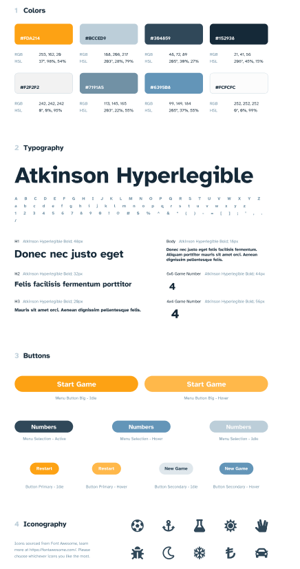
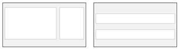
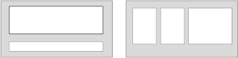

# Projet 1

## Objectif #1
Réaliser la conception d’un site web, d’une interface d’administration et d’une newsletter au sein de votre formation.
### Projet #1 :
* Choisissez un sujet qui vous tient à coeur dans les 2 domaines proposés ci-dessous :
  * Touristique (une ville, un monument, un pays, un domaine skiable, un lac, etc.)
  * Artistique (musicien, sculpteur, architecte, artisanat d’art, plasticien, designer, réalisateur, etc.)
* Le sujet doit exister réellement, votre mission est de le valoriser.
* __Point de vigilance :__
  * Votre objectif n’est pas de remplacer le site de votre sujet, mais de créer une unique page informative des éléments que vous souhaitez mettre en lumière. Par exemple, si vous choisissez le domaine skiable de Val d’Isère, vous trouverez certainement un système de réservation, le prix des forfaits, informations liées à la météo, etc.
  * Le site existant possède une logique commerciale, ceci n’est pas la demande.
  * Pour cette première page web à concevoir intégralement (écriture, zoning, maquettage) Il vous sera plus aisé de vous concentrer sur une partie plus restreinte de votre sujet.
  * Dans le cas de Val d’Isère, nous vous conseillerons de vous concentrer uniquement sur la face de Bellevarde (création. Histoire, pourcentage de pente, etc.)

* __Exemples de sites officiels :__
  * https://www.atelier-lumieres.com/
  * https://www.theweeknd.com/
* __Exemples de site officiels « discutables graphiquement » de personnalités mondialement connues :__
  * https://pilobolus.org/
  * https://www.hockney.com/home
  * http://www.jeffkoons.com/
  * https://www.davidgilmour.com/
  * https://www.starck.fr/
  * Frank Gerhy / pas de site officiel

### Itérations du projet #1
#### Itération # A.1 : Analyse
* Une fois que vous avez choisi votre sujet et qu’il est validé par votre coach vous devez alors réaliser une analyse de l’identité visuelle existante du sujet. Par exemple, votre sujet possède-t-il un logo, une charte graphique, des couleurs dominantes, etc.. ; ?
* Quelle est d’après-vous la stratégie digitale mise en place par votre sujet. Par exemple le site possède-t-il un formulaire de contact, une newsletter, les liens vers les réseaux sociaux ?

#### Itération #A.2 : Cahier des charges
* À partir de l’analyse réaliser un cahier des charges en tenant compte du canevas suivant :
  * Présentation de l’entreprise
  * Cible à laquelle s’adresse le site
  * État des lieux de l’existant
  * Arborescence du site
  * Description fonctionnelle : exemple abonnement à une newsletter, barre de recherche, intégrer un blog, formulaire de contact, carte google…
  * Contenu présent sur le site
#### Itération #A.3 : Planche de tendance
* À partir de sites concurrents (benchmark) ou de site d’inspiration, ajouter les éléments sur votre planche de tendance. Ses éléments peuvent être des captures d’écrans, des palettes de couleurs, des photographies d’ambiances, des échantillons de matières, des croquis et éventuellement du texte.

#### Itération #A.4 Design System
* Choisir une convention de nommage, un vocabulaire facile à comprendre pour toutes les personnes impliquées où qui le seront à l’avenir.
* Définir la charte graphique comme l’exemple ci-dessous

#### Itération #A.5 Maquetter le Header
* Créer la maquette graphique du header de votre page web en choisissant parmi les 2 zoning proposés :
  * 1 composition graphique dans Photoshop
  * Présence de 2 à 3 textes
  * Intégration à minima d’un web font et de deux au maximum.
  * 

#### Itération #A.6 Zoning contenu principal
* Faites une proposition de zoning des différentes sections de votre contenu.
* Présenter vos zoning à l’ensemble de votre promo pour validation

#### Itération #A.7 Maquetter le contenu principal
* Créer la maquette graphique du contenu de votre page web composition graphique dans Photoshop
  * Tenir compte de votre Design System
  * Maquetter en tenant compte de votre zoning
  * 

#### Itération #A.8 Maquetter le pied de page
* Créer la maquette graphique du pied de page de votre page web en choisissant parmi les 2 zoning proposés :
  * 1 composition graphique dans Photoshop
  * Présence de 2 à 3 textes
  * Intégration à minima d’un web font et de deux au maximum.
  * Présence du formulaire d’inscription à la newsletter

#### Itération #A.9 Responsive
* Décliner la maquette au format Tablette et Mobile